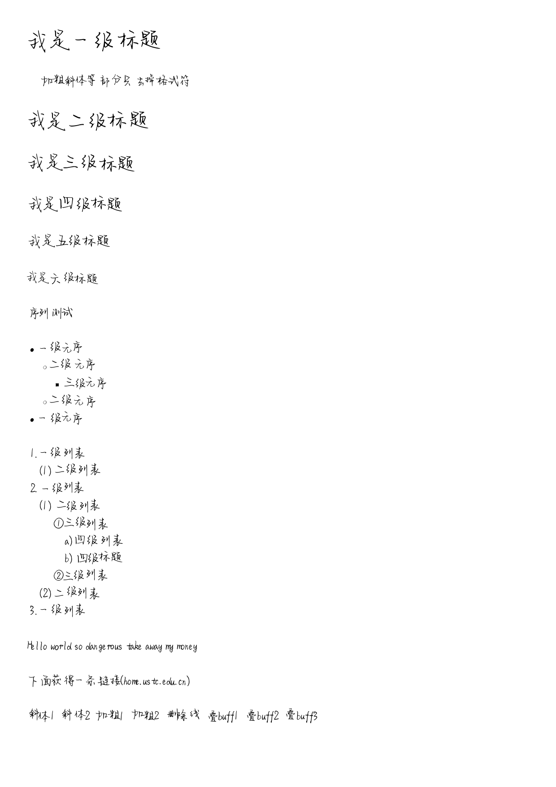

# HandWrite

模仿手写字迹

支持部分 markdown

```python
text_re = [
    r'\~\~([^\~]+)\~\~',
    r'\*\*([^\*]+)\*\*',
    r'\_\_([^\_]+)\_\_',
    r'\=\=([^\=]+)\=\=',
    r'\*([^\*]+)\*',
    r'\_([^\_]+)\_',
    r'\`([^\`]+)\`'
]
# 直接去掉所有有标题的内容
string = re.sub(r'(#+) (.+)[.\n]', lambda x: x.group(2)+'\n', string)
# 有序无序在一起会很丑陋
string = re.sub(r'[\-\+\*] (.+)[.\n]', lambda x: ' ·'+x.group(1)+'\n', string)
string = re.sub(r'(\d.) (.+)[.\n]', lambda x: ' '+x.group(1)+x.group(2)+'\n', string)
# 去掉链接
string = re.sub(r'\[(.+)\]\((.+)\)', lambda x: x.group(1)+'('+x.group(2)+')', string)
# 去掉text内容
for iter in text_re:
    string = re.sub(iter, lambda x: x.group(1), string)
```



